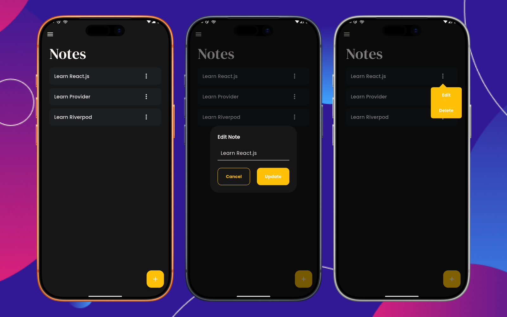

# Notes App

[](https://flutter.dev)
[](https://dart.dev)
[](#license)
[](#)

A modern, feature-rich Flutter application for creating, managing, and organizing personal notes. This app provides a clean and intuitive interface with support for both light and dark themes, local data persistence, and a smooth user experience.



## Table of Contents

- [Features](#features)
- [Tech Stack](#tech-stack)
- [Project Structure](#project-structure)
- [Installation](#installation)
- [Usage](#usage)
- [Architecture](#architecture)
- [Contributing](#contributing)
- [Testing](#testing)
- [License](#license)
- [Contact](#contact)

## Features

✨ **Core Features:**
- ✅ **Create Notes** - Easily add new notes with a simple dialog interface
- ✅ **Edit Notes** - Modify existing notes with real-time updates
- ✅ **Delete Notes** - Remove notes with a single action
- ✅ **View All Notes** - Browse all notes in a beautiful grid/card layout
- ✅ **Local Data Persistence** - All notes are saved locally using SQLite
- ✅ **Responsive Design** - Works seamlessly on phones, tablets, and web

🎨 **UI/UX Features:**
- 🌓 **Dark Mode & Light Mode** - Automatic theme switching based on system preferences
- 🎨 **Material 3 Design** - Modern Material Design 3 components and guidelines
- 📱 **Intuitive Navigation** - Bottom navigation bar for easy access
- 🎭 **Custom Theming** - Customized color schemes and typography using Google Fonts
- 📲 **App Drawer** - Quick navigation menu with app information

## Tech Stack

### Languages & Frameworks
- **Flutter** - Cross-platform mobile framework
- **Dart** - Programming language for Flutter

### Key Dependencies
| Package | Purpose |
|---------|---------|
| `provider` ^6.1.5 | State management |
| `sqflite` ^2.4.2 | Local SQLite database |
| `go_router` ^17.0.1 | Routing and navigation |
| `google_fonts` ^7.0.0 | Beautiful Google Fonts |
| `google_nav_bar` ^5.0.7 | Custom bottom navigation bar |
| `flutter_svg` ^2.2.3 | SVG asset support |
| `path_provider` ^2.1.5 | File system access |
| `popover` ^0.4.0 | Popover UI components |

### Dev Dependencies
- `flutter_test` - Flutter testing framework
- `build_runner` ^2.10.4 - Code generation
- `freezed` ^3.2.4 - Immutable model generation
- `flutter_lints` ^6.0.0 - Lint rules

## Installation

### Prerequisites

Before you begin, ensure you have the following installed:

- **Flutter SDK** (v3.10.7 or higher) - [Download](https://flutter.dev/docs/get-started/install)
- **Dart SDK** (included with Flutter)
- **Git** - [Download](https://git-scm.com/downloads)
- **Android Studio** or **Xcode** (for emulators/simulators)

### Step-by-Step Setup

1. **Clone the repository**
   ```bash
   git clone https://github.com/fathorrosi-dev/notes_app.git
   cd notes_app
   ```

2. **Get Flutter dependencies**
   ```bash
   flutter pub get
   ```

3. **Run the application**
   
   On Android:
   ```bash
   flutter run
   ```
   
   On iOS:
   ```bash
   flutter run -d ios
   ```
   
   On Web:
   ```bash
   flutter run -d chrome
   ```

4. **(Optional) Run code generation**
   ```bash
   flutter pub run build_runner build
   ```

## Usage

### Basic Workflow

1. **Launch the app** - Start the application using `flutter run`
2. **View Notes** - Home screen displays all saved notes in a card layout
3. **Add a Note** - Tap the floating action button to open the "Add Note" dialog
4. **Edit a Note** - Long-press on a note card to edit its content
5. **Delete a Note** - Tap the delete option on a note card or through the context menu
6. **Switch Themes** - The app automatically adapts to your system theme preference

### Code Examples

#### Creating a Note Programmatically
```dart
// Import the provider
import 'package:notes_app/provider/notes_provider.dart';
import 'package:notes_app/model/note_model.dart';

// In your widget
final notesProvider = context.read<NotesProvider>();

// Create a new note
final newNote = NoteModel(title: 'My First Note');
await notesProvider.addNote(newNote);
```

#### Listening to Note Changes
```dart
// Listen to note provider changes
Consumer<NotesProvider>(
  builder: (context, notesProvider, child) {
    return ListView.builder(
      itemCount: notesProvider.notes.length,
      itemBuilder: (context, index) {
        final note = notesProvider.notes[index];
        return ListTile(title: Text(note.title));
      },
    );
  },
)
```

## Project Structure

```
notes_app/
├── lib/
│   ├── main.dart                          # App entry point
│   ├── data/
│   │   └── local_data_source.dart         # SQLite database operations
│   ├── model/
│   │   └── note_model.dart                # Note data model
│   ├── provider/
│   │   └── notes_provider.dart            # State management (Provider)
│   └── screen/
│       ├── home_screen/
│       │   ├── home_screen.dart           # Main home screen
│       │   └── components/
│       │       ├── app_drawer.dart        # Navigation drawer
│       │       ├── note_card.dart         # Note display card
│       │       └── note_settings.dart     # Note settings menu
│       ├── styles/
│       │   ├── theme.dart                 # Light & dark themes
│       │   ├── text_themes.dart           # Typography styles
│       │   ├── input_themes.dart          # Input field styles
│       │   ├── card_themes.dart           # Card component styles
│       │   └── elevated_button_themes.dart # Button styles
│       └── utils/
│           ├── router.dart                # Navigation routing
│           ├── constants/
│           │   └── colors.dart            # Color constants
│           └── helpers/
│               └── helper_function.dart   # Utility functions
├── android/                               # Android platform code
├── ios/                                   # iOS platform code
├── web/                                   # Web platform code
├── linux/                                 # Linux platform code
├── macos/                                 # macOS platform code
├── windows/                               # Windows platform code
├── test/                                  # Test files
├── assets/                                # Image and media assets
├── pubspec.yaml                           # Project dependencies
└── analysis_options.yaml                  # Lint rules

```

### Key Directory Descriptions

- **`lib/data/`** - Data layer handling local database operations using SQLite
- **`lib/model/`** - Domain models (NoteModel)
- **`lib/provider/`** - State management using Provider package
- **`lib/screen/`** - UI layer with all screens and components
- **`assets/`** - Static assets including images

## Architecture

This application follows the **Provider Pattern** for state management combined with a **layered architecture**:

### Layers

1. **Presentation Layer** (`screen/`)
   - UI components and screens
   - Handles user interactions
   - Displays data from providers

2. **State Management Layer** (`provider/`)
   - `NotesProvider` manages application state
   - Handles CRUD operations
   - Notifies listeners of state changes

3. **Data Layer** (`data/`)
   - `LocalDataSource` handles database operations
   - SQLite database management
   - Data persistence

4. **Domain Layer** (`model/`)
   - `NoteModel` - pure data class
   - Business logic models

### State Management Flow

```
UI (Widget) 
  ↓ (listens via Provider)
NotesProvider (ChangeNotifier)
  ↓ (performs operations)
LocalDataSource (Database)
  ↓ (CRUD operations)
SQLite Database
```

## Contributing

We welcome contributions from the community! Here's how you can help:

### Getting Started with Development

1. **Fork the repository** on GitHub
2. **Create a feature branch**
   ```bash
   git checkout -b feature/your-feature-name
   ```
3. **Make your changes** following the code style guidelines
4. **Commit your changes** with clear commit messages
   ```bash
   git commit -m "feat: add new feature description"
   ```
5. **Push to your fork**
   ```bash
   git push origin feature/your-feature-name
   ```
6. **Open a Pull Request** with a description of your changes

### Code Style Guidelines

- Follow [Dart Style Guide](https://dart.dev/guides/language/effective-dart/style)
- Use meaningful variable and function names
- Add comments for complex logic
- Run `flutter analyze` before committing
- Use `dart format` for consistent formatting:
  ```bash
  dart format lib/
  ```

### Commit Message Format

```
<type>: <subject>

<body>

<footer>
```

Types: `feat`, `fix`, `docs`, `style`, `refactor`, `test`, `chore`

Example:
```
feat: add note search functionality

Added a search field to the home screen that filters notes by title.
Users can now quickly find notes using the search feature.

Closes #123
```

### Pull Request Guidelines

- Provide a clear description of changes
- Link to relevant issues
- Ensure all tests pass
- Update documentation if needed
- Keep PRs focused and reasonably sized

## Testing

### Running Tests

```bash
# Run all tests
flutter test

# Run tests with coverage
flutter test --coverage

# Run specific test file
flutter test test/widget_test.dart
```

### Test Structure

Tests are located in the `test/` directory:
- `widget_test.dart` - Widget and integration tests

### Writing Tests

Example test for note creation:
```dart
void main() {
  testWidgets('Add note dialog appears when FAB is pressed', (tester) async {
    await tester.pumpWidget(const MyApp());
    
    // Find and tap the FAB
    await tester.tap(find.byType(FloatingActionButton));
    await tester.pumpWidget(const MyApp());
    
    // Verify dialog appears
    expect(find.byType(AlertDialog), findsOneWidget);
  });
}
```

### Future Testing Plans

- [ ] Implement unit tests for providers
- [ ] Add widget tests for all screens
- [ ] Create integration tests for main user flows
- [ ] Set up CI/CD testing pipeline

## Roadmap (Future Enhancements)

### Version 1.1
- [ ] Add note categories/tags
- [ ] Implement search functionality
- [ ] Add note sharing feature
- [ ] Export notes to PDF

### Version 1.2
- [ ] Cloud sync with Firebase
- [ ] Collaborative notes
- [ ] Rich text editor
- [ ] Image attachments

### Version 2.0
- [ ] Voice-to-text note creation
- [ ] Advanced search with filters
- [ ] Note reminders and notifications
- [ ] Desktop sync

## License

This project is licensed under the MIT License - see the [LICENSE](LICENSE) file for details.

The MIT License is a permissive license that allows:
- ✅ Commercial use
- ✅ Modification
- ✅ Distribution
- ✅ Private use

With conditions:
- ⚠️ License and copyright notice required

## Contact & Authors

**Maintainer:** [fathorrosi-dev](https://github.com/fathorrosi-dev)

For questions, suggestions, or bug reports, please:
- 📧 Open an issue on [GitHub Issues](https://github.com/fathorrosi-dev/notes_app/issues)
- 🐛 Report bugs with detailed reproduction steps
- 💡 Suggest features with clear use cases

---

<div align="center">

**Made with ❤️ using Flutter**

[⬆ back to top](#notes-app)

</div>
